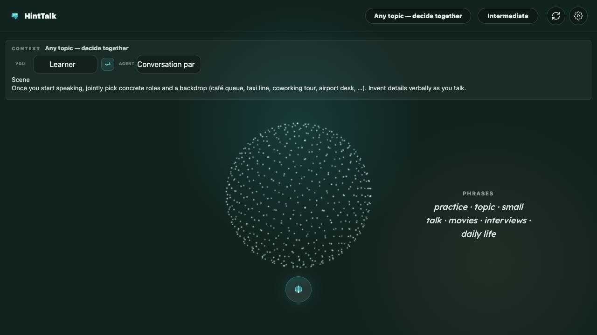

# HintTalk

HintTalk is a local-first English speaking practice app focused on **Live Voice** role-play in the browser. The app uses OpenAI Realtime for speech conversation and an optional OpenAI-compatible chat model for hints/translations.



## Security Notes

HintTalk is designed for personal/local use. It does **not** include a backend account system or encrypted key vault.

Important details about API key storage:

- Keys entered in the app are saved in your browser `localStorage`.
- `localStorage` is readable by JavaScript running on this app origin.
- Anyone with access to your browser profile, devtools, disk profile data, or an unlocked machine may be able to read the stored key.
- Browser sync, backup tools, malware, extensions, or shared user accounts may increase exposure risk.
- Do not use this setup on a shared/public computer.
- Do not deploy this app publicly with user-supplied browser-stored keys.
- Do not commit API keys or paste them into screenshots, logs, issues, or chat.

Recommended usage:

- Use a dedicated OpenAI project/key for HintTalk.
- Set conservative project limits/budgets in your OpenAI account.
- Rotate or delete the key if you suspect it was exposed.
- For public or team deployment, move API calls server-side and store keys in server environment variables or a managed secrets system.

How to remove stored keys from this app:

1. Open `/live-voice`.
2. Click the gear icon.
3. Clear the API key fields and save.

You can also clear the site data in your browser settings, or remove the `hinttalk.settings.v1` entry from devtools `Application` -> `Local storage`.

The bundled `/openai` proxy is scoped for local/personal use and only forwards the OpenAI endpoints used by this app.

## Requirements

- Node.js 22+
- npm
- Docker + Docker Compose, if running the container
- An OpenAI API key for live voice and model-backed hints

API keys are entered in the app UI and stored in browser `localStorage` on your device. Read the security notes above before using a real key.

## Get an OpenAI API Key

1. Go to [platform.openai.com](https://platform.openai.com/).
2. Sign in or create an OpenAI account.
3. Open the API keys page: [platform.openai.com/api-keys](https://platform.openai.com/api-keys).
4. Create a new secret key.
5. Copy the key once and keep it private.

You may also need to set up billing/credits in your OpenAI account before API calls work.

## Run Locally

You can run HintTalk directly with Node.js for development, or with Docker for a production-like local container.

### Option A: Node.js Development Server

From the repository root:

```bash
cd web
npm ci
npm run dev
```

Open the URL printed by Vite, usually:

```text
http://localhost:5173/live-voice
```

The Vite dev server proxies `/openai/*` to OpenAI so browser requests avoid CORS issues.

### Option B: Docker Container

From the repository root:

```bash
docker compose up --build
```

Open:

```text
http://localhost:21079/live-voice
```

To map a different host port:

```bash
HINTTALK_PORT=3000 docker compose up --build
```

Then open:

```text
http://localhost:3000/live-voice
```

## Run Production-Style With Node.js

From the repository root:

```bash
cd web
npm ci
npm run build
npm run start
```

Default URL:

```text
http://localhost:21079/live-voice
```

To use a different port:

```bash
PORT=9000 npm run start
```

Then open:

```text
http://localhost:9000/live-voice
```

## Deploy To Production

There are two supported deployment options. Both serve the app and the `/openai` proxy from a single process listening on `PORT` (default `21079`). A `GET /healthz` endpoint is available for health checks, and the server shuts down gracefully on `SIGTERM`/`SIGINT`.

> Read the Security Notes above first — this app stores API keys in browser `localStorage` and is intended for personal use, not public multi-user deployment.

### Option 1: Docker

Build and run on the server (or build locally / in CI and push to a registry):

```bash
# On the server, from the repository root
docker compose up --build -d

# Status + health
docker compose ps
docker compose logs --tail=50

# Update to a new version
git pull && docker compose up --build -d
```

The compose file includes a healthcheck, `restart: unless-stopped`, and log rotation. To change the host port:

```bash
HINTTALK_PORT=8080 docker compose up --build -d
```

To build a standalone image without compose:

```bash
docker build -t hinttalk:latest .
docker run -d --name hinttalk -p 21079:21079 --restart unless-stopped hinttalk:latest
```

### Option 2: Bare Node.js Process On The Server

The runtime has **no npm dependencies** (`server.mjs` only uses Node built-ins), so a release is just `dist/` + `server.mjs`. The only server requirement is Node.js 22+.

Package a release tarball from your machine:

```bash
./deploy/package-release.sh
# → release/hinttalk-<timestamp>.tar.gz
```

Ship and extract it on the server:

```bash
scp release/hinttalk-latest.tar.gz user@server:/tmp/
ssh user@server
sudo mkdir -p /opt/hinttalk
sudo tar -xzf /tmp/hinttalk-latest.tar.gz -C /opt/hinttalk
```

Then keep it running with **systemd** (recommended on Linux servers):

```bash
sudo useradd --system --no-create-home --shell /usr/sbin/nologin hinttalk || true
sudo chown -R hinttalk:hinttalk /opt/hinttalk
sudo cp /opt/hinttalk/deploy/hinttalk.service /etc/systemd/system/
sudo systemctl daemon-reload
sudo systemctl enable --now hinttalk
systemctl status hinttalk
```

Or with **PM2** if you prefer:

```bash
cd /opt/hinttalk
pm2 start deploy/ecosystem.config.cjs
pm2 save && pm2 startup
```

Verify either option:

```bash
curl http://localhost:21079/healthz
# {"status":"ok","uptime":…}
```

### Reverse Proxy / HTTPS

The realtime voice feature uses `getUserMedia`, which browsers only allow on `https://` origins (or `http://localhost`). For any non-localhost deployment, put the app behind a TLS-terminating reverse proxy (Caddy, nginx + certbot, Traefik, …). Example with Caddy:

```text
hinttalk.example.com {
    reverse_proxy localhost:21079
}
```

## Configure The App

1. Open `/live-voice`.
2. Click the gear icon in the top-right.
3. Fill in:
   - Realtime API key: your OpenAI API key.
   - Realtime model: default is `gpt-realtime-mini`.
   - Voice: choose one of the app-supported voices.
   - Hint API key: your OpenAI API key, if you want model-backed hints/translations.
   - Hint base URL: keep `https://api.openai.com/v1` for OpenAI.
   - Hint model: default is `gpt-4o-mini`.
4. Save settings.
5. Click the mic button to start a live voice session.

## Useful Commands

```bash
# Web dev server
cd web && npm run dev

# TypeScript build + Vite production build
cd web && npm run build

# ESLint
cd web && npm run lint

# Static production server
cd web && npm run start

# Docker rebuild and restart
docker compose up --build -d

# Docker logs
docker compose logs --tail=100
```
